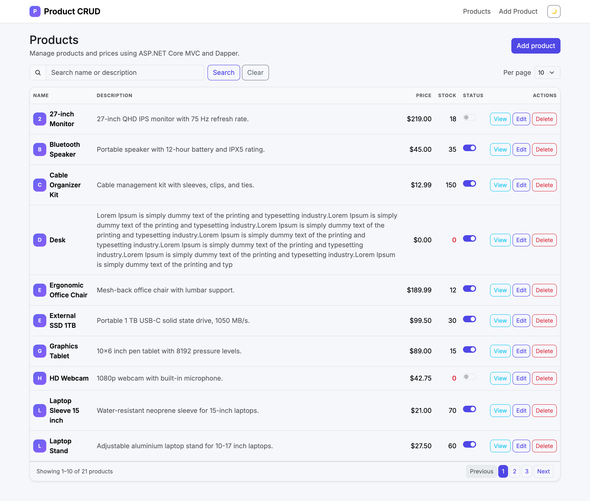
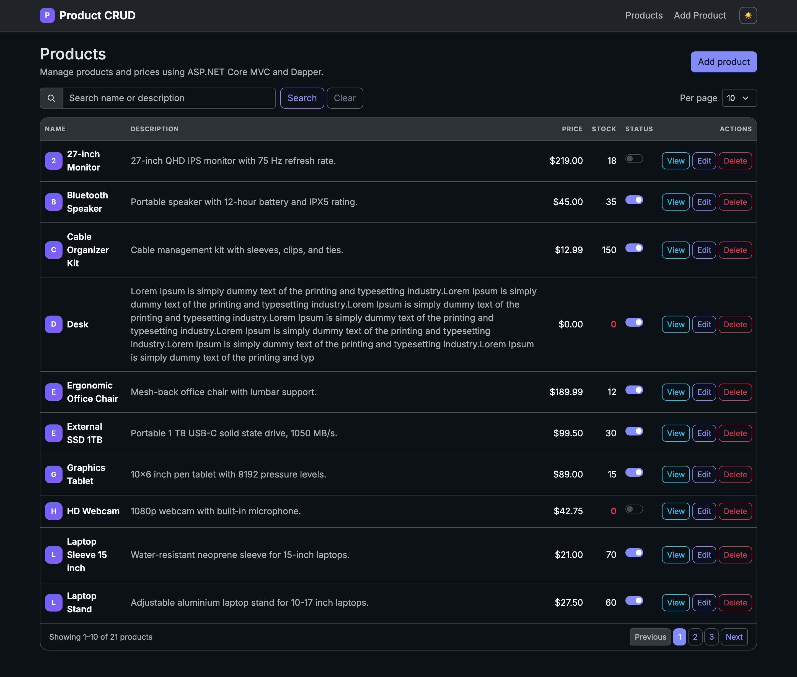
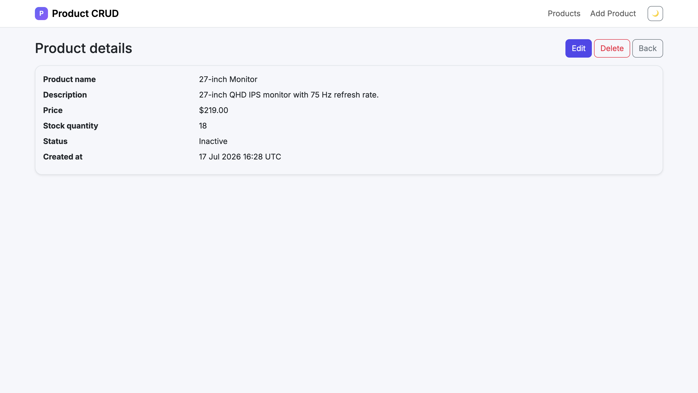
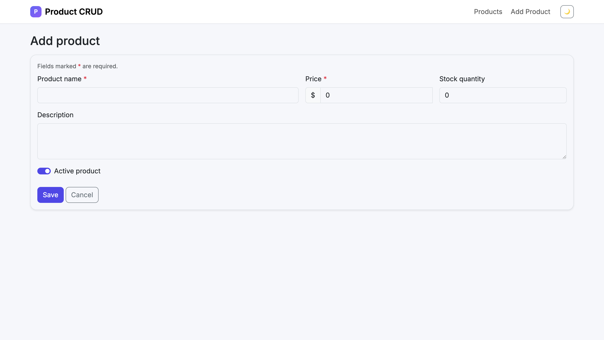
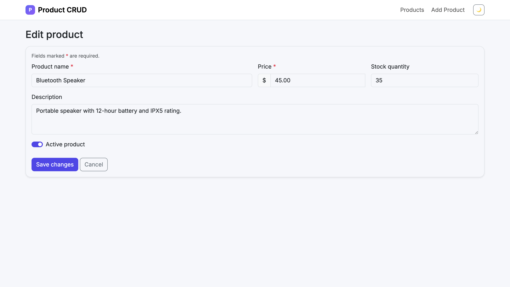
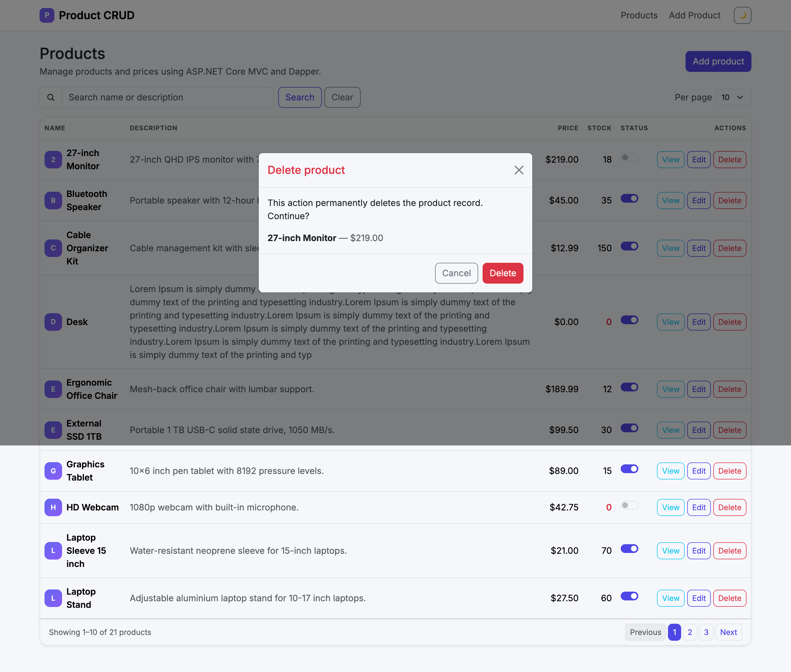

# Product CRUD — ASP.NET Core MVC + Dapper

A simple product management web application built for the Qutiq Myanmar Co., Ltd.(QHRM).
practical test. It demonstrates complete CRUD operations using:

- ASP.NET Core MVC (.NET 10 LTS)
- Razor Views, Bootstrap 5, and jQuery
- Dapper
- Microsoft SQL Server / LocalDB
- Repository pattern and dependency injection
- Data annotations and server/client validation
- Parameterized SQL

## Features

- Homepage that lists products with their prices (with search)
- Server-side pagination with active/disabled pager states and a
  selectable page size (5 / 10 / 15 / 20)
- Search uses SQL Server Full-Text Search (`CONTAINS` with prefix matching)
  when available, and falls back to `LIKE` automatically otherwise
- Add Product page
- Edit Product page
- Delete with a Bootstrap/jQuery confirmation modal on the product list
  (plus a no-JavaScript fallback confirmation page)
- Product details page
- Duplicate product name validation
- Success messages
- Seed data
- Responsive Bootstrap layout

## Screenshots

| Product list (light) | Product list (dark) | Product details |
|---|---|---|
|  |  |  |

| Add product | Edit product | Delete confirmation |
|---|---|---|
|  |  |  |

## Project structure

```text
ProductCrudDapper/
├── database/
│   └── 01-create-database.sql
├── src/
│   └── ProductCrud.Web/
│       ├── Controllers/
│       ├── Data/
│       ├── Models/
│       ├── Repositories/
│       ├── Views/
│       └── wwwroot/
├── tests/
│   └── ProductCrud.Web.Tests/
├── .gitignore
├── README.md
└── ProductCrudDapper.sln
```

## Prerequisites

- .NET 10 SDK
- Visual Studio 2022, VS Code, or JetBrains Rider
- SQL Server LocalDB, SQL Server Express, or SQL Server

All SQL is portable T-SQL: it uses no features newer than SQL Server 2012
(`OFFSET`/`FETCH` paging), so the project runs unmodified on every supported
SQL Server version
(2017, 2019, 2022, and 2025) as well as Azure SQL. Full-Text Search is an
optional SQL Server component; both the setup script and the application
detect whether it is installed and fall back to `LIKE` search when it is not.

## Database setup

1. Open SQL Server Management Studio or Azure Data Studio.
2. Connect to `(localdb)\\MSSQLLocalDB`.
3. Run `database/01-create-database.sql`.

The connection string is **not** stored in `appsettings.json`. The app reads
`ConnectionStrings:DefaultConnection` through the standard ASP.NET Core
configuration system and fails fast at startup if it is missing. Supply it
with the `ConnectionStrings__DefaultConnection` environment variable
(double underscore maps to the `:` separator on every platform):

Linux/macOS:

```bash
export ConnectionStrings__DefaultConnection="Server=localhost,1433;Database=ProductCrudDb;User Id=sa;Password=YOUR_PASSWORD;TrustServerCertificate=True;"
```

Windows PowerShell:

```powershell
$env:ConnectionStrings__DefaultConnection = "Server=localhost,1433;Database=ProductCrudDb;User Id=sa;Password=YOUR_PASSWORD;TrustServerCertificate=True;"
```

Windows cmd:

```cmd
set ConnectionStrings__DefaultConnection=Server=localhost,1433;Database=ProductCrudDb;User Id=sa;Password=YOUR_PASSWORD;TrustServerCertificate=True;
```

For day-to-day local development, prefer .NET User Secrets (first-party,
stored outside the repository):

```bash
cd src/ProductCrud.Web
dotnet user-secrets set "ConnectionStrings:DefaultConnection" "Server=localhost,1433;Database=ProductCrudDb;User Id=sa;Password=YOUR_PASSWORD;TrustServerCertificate=True;"
```

No password or secret is committed anywhere in this repository.

## Run with Docker (recommended)

From the repository root, with Docker (or OrbStack) running:

```bash
export MSSQL_SA_PASSWORD='YourStrongPassword1!'   # PowerShell: $env:MSSQL_SA_PASSWORD = '...'
docker volume create sqlvolume
docker compose up -d --build
```

This starts three services:

1. `sqlserver` — SQL Server 2022 built from `database/sqlserver-fts.Dockerfile`
   (adds the Full-Text Search feature, which the stock image lacks), with data
   persisted in the `sqlvolume` volume
2. `db-init` — a one-shot job that runs `database/01-create-database.sql`
   (idempotent, so repeated `up` runs are safe)
3. `web` — the ASP.NET Core app, built from `src/ProductCrud.Web/Dockerfile`

Open <http://localhost:8080> when `docker compose ps` shows both long-running
services up. Stop with `docker compose down` (data survives; add `-v` only if
you want to wipe the database volume).

`docker-compose.yml` contains no password: it interpolates
`${MSSQL_SA_PASSWORD}` from your shell environment and passes the app its
connection string as the `ConnectionStrings__DefaultConnection` environment
variable. Compose fails fast with a clear message if the variable is not set.

## Run the application (local SDK)

From the repository root:

```bash
dotnet restore
dotnet run --project src/ProductCrud.Web
```

Set the connection string first via User Secrets or the
`ConnectionStrings__DefaultConnection` environment variable (see Database
setup above); the app refuses to start without it.

Open the localhost URL printed in the terminal. The homepage shows the product list.

## Run tests

The solution includes xUnit tests for controller behavior, model validation,
MVC feature flows, invalid numeric input, and HTML/JavaScript payload encoding.
The tests replace the SQL Server repository with an in-memory repository, so no
database is required.

With the .NET SDK installed:

```bash
dotnet test ProductCrudDapper.sln
```

With Docker only:

```bash
docker run --rm \
  -e ConnectionStrings__DefaultConnection=Server=localhost \
  -v "$PWD:/work" \
  -w /work \
  mcr.microsoft.com/dotnet/sdk:10.0 \
  dotnet test ProductCrudDapper.sln
```

The dummy connection string is required because the web app validates that a
connection string exists at startup; the tests still use an in-memory product
repository and do not connect to SQL Server.

## How it works

1. `ProductsController` receives the browser request.
2. The controller validates the model and calls `IProductRepository`.
3. `ProductRepository` executes parameterized SQL through Dapper.
4. SQL Server returns the result.
5. The controller selects a Razor View.
6. The Razor View renders HTML for the browser.

### Search design: Full-Text Search with LIKE fallback

The search box uses SQL Server Full-Text Search when available: the setup
script creates a full-text catalog and index on `Name` and `Description`
(guarded by `SERVERPROPERTY('IsFullTextInstalled')`), and the repository turns
the user's input into a `CONTAINS` query with per-word prefix matching
(`mech keyb` becomes `"mech*" OR "keyb*"`), passed as a Dapper parameter so
user input is never interpreted as SQL or CONTAINS syntax. Because FTS is an
optional SQL Server component, the repository detects at runtime whether a
full-text index exists and falls back to a portable `LIKE` search when it does
not — the app works on any SQL Server installation either way. The Docker
image is built from `database/sqlserver-fts.Dockerfile`, which adds the FTS
package the stock Linux image lacks.
